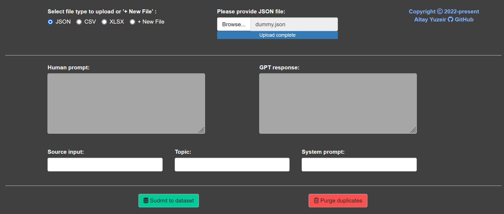
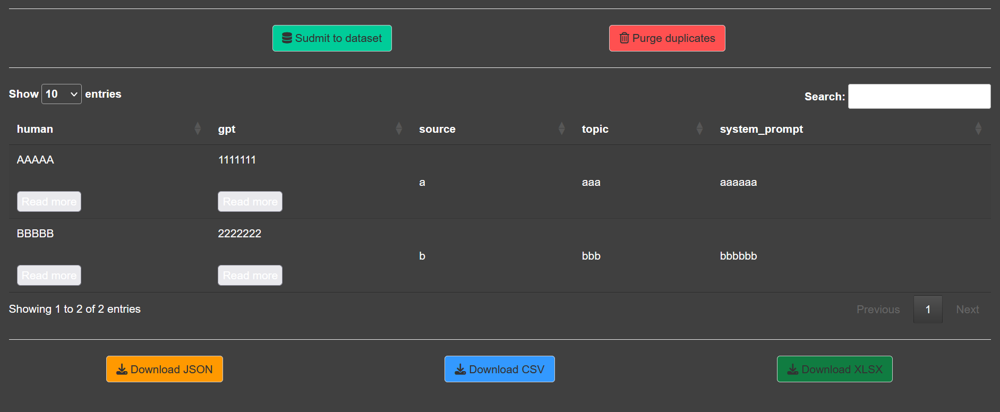

## Shiny_AI_dataset_creator
Easy interaction with JSON files and conversion between JSON, CSV and XLSX with few clicks.\
Perfect for creating JSON files for fine-tuning large language modals.

#### JSON structure:
- id: a randomly generated uuid
- conversations: single turn human & gpt turns in ShareGPT format
- source: source of the conversation, for metadata purposes when merging with others
- topic: the sub-topic for the domain
- system_prompt: type of system prompt used for generating the response.

#### CSV and XLSX structure:
- human: prompt from the conversations
- gpt: response from the conversations
- source: source of the conversation, for metadata purposes when merging with others
- topic: the sub-topic for the domain
- system_prompt: type of system prompt used for generating the response.

## Acknowledgements
The neat functionality to hide and show full text in the table is provided by Stéphane Laurent on [Stackoverflow](https://stackoverflow.com/questions/75236102/read-more-buttons-for-long-text-in-r-shiny-dt-datatables).
